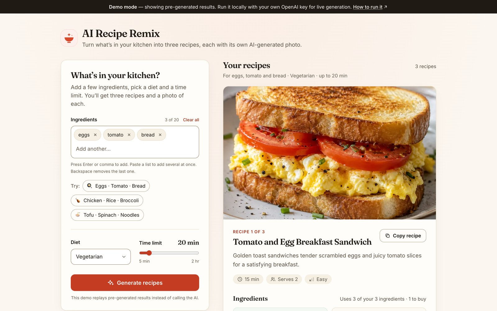
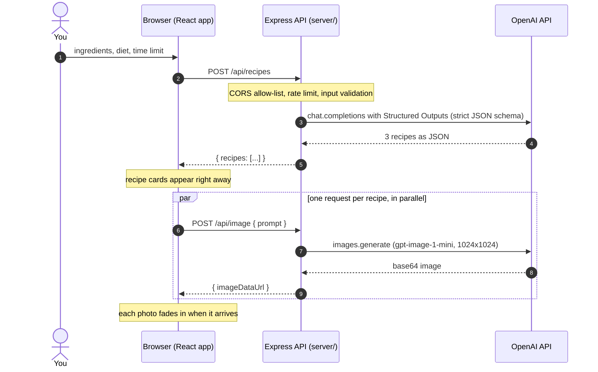

# AI Recipe Remix

**Tell it what's in your kitchen. Get three recipes, each with its own AI-generated photo.**

AI Recipe Remix is a full-stack web app by Xinyue (Lily) Feng. Type the ingredients you already have, pick a diet and a time limit, and an OpenAI model writes three realistic recipes. Every recipe card shows which ingredients are already in your kitchen and which you'd need to buy, followed by numbered steps, substitutions, allergens and tips, with a food photo generated for that dish.



The portfolio hosts a static [demo build](https://samsi0322.github.io/xinyue-feng/play/recipe-remix/) that replays pre-generated results ([how it works](#demo-mode)), so no key is needed to look around. To generate live, [run it locally](#local-setup) with your own OpenAI API key.

## Features

- **Ingredient chips.** Press Enter or type a comma (the Chinese "，" works too) to add an ingredient. Paste a list (comma-separated or one per line) to add several at once. Backspace in the empty box removes the last chip, and × removes any chip. Duplicates are ignored, so "Eggs" and "egg" count once.
- **Diet and time limit.** Choose no preference, vegetarian, vegan, halal or gluten-free, and set a time limit from 5 to 120 minutes with a slider.
- **Three recipes, always well-formed.** The server uses OpenAI Structured Outputs with a strict JSON schema, so every response has the same shape.
- **In your kitchen vs. to buy.** Matching tolerates case, plurals, sizes and prep notes ("egg" matches "large eggs", "tomato" matches "Roma tomatoes, diced") without mixing up different products ("rice" is not "rice vinegar"). Each card sums it up, e.g. "Uses 3 of your 3 ingredients · 2 to buy". Water, salt and black pepper are treated as pantry staples.
- **A photo for every recipe.** Photos are requested in parallel and each one fades in as soon as it's ready. A slow or failed photo never holds up the others, and a failed one can be retried on its own.
- **Copy recipe.** Copies the whole recipe as plain text, ready to paste into notes or a chat.
- **Clear loading and errors.** Skeleton cards appear while the recipes are written. Errors are plain-language messages with a retry button, never stack traces.
- **Accessible.** Real labels, visible keyboard focus, screen-reader announcements ("Generating recipes…", "3 recipes ready", "Image ready: …"), WCAG AA contrast (checked by a test) and support for reduced motion.
- **Demo mode.** A static build with pre-generated samples and realistic timing, for hosting without a backend.

## How it works



The browser only ever talks to the Express server, and the OpenAI key never leaves the server. In [demo mode](#demo-mode) there is no server at all: the app picks a pre-generated preset and replays it with realistic delays.

API summary:

| Endpoint | Request | Response |
| --- | --- | --- |
| `GET /api/health` | | `{ "ok": true }` |
| `POST /api/recipes` | `{ "ingredients": ["eggs", "tomato"], "diet": "vegetarian", "time": 20 }` | `{ "recipes": [Recipe, Recipe, Recipe] }` |
| `POST /api/image` | `{ "prompt": "High quality food photography of: …" }` | `{ "imageDataUrl": "data:image/webp;base64,…" }` |

A `Recipe` is `{ title, summary, timeMinutes, servings, difficulty: "easy" | "medium" | "hard", ingredients: [{ item, amount, optional }], steps: [], substitutions: [], allergens: [], tips: [] }`; the schema lives in [`server/src/recipe-schema.js`](server/src/recipe-schema.js). Errors come back as `{ "error": "Short, friendly message." }` with a 4xx or 5xx status.

## Tech stack

- **Frontend:** React 19, Vite 8, Tailwind CSS 3, self-hosted Fraunces and Inter variable fonts (Fontsource)
- **Backend:** Node.js 22+, Express 5, OpenAI Node SDK 7, express-rate-limit, cors, dotenv
- **Quality:** ESLint 10 and Node's built-in test runner (`node:test`); no extra test framework

## Local setup

You need Node.js 22.13 or newer and an OpenAI API key.

1. Install dependencies for the frontend and the backend:

   ```bash
   npm install
   cd server && npm install && cd ..
   ```

2. Create the backend config and add your key:

   ```bash
   cp server/.env.example server/.env
   # edit server/.env and set OPENAI_API_KEY=sk-...
   ```

3. Start both parts, each in its own terminal:

   ```bash
   # terminal 1: the API on http://localhost:8080
   cd server
   npm run dev
   ```

   ```bash
   # terminal 2: the app on http://localhost:5173
   npm run dev
   ```

4. Open http://localhost:5173. In development the app calls `/api/...` on its own origin and Vite proxies those requests to port 8080, so no extra setup is needed.

Without a key the server still starts, but `/api/recipes` and `/api/image` answer 503 with a reminder to add one.

### Scripts

| Where | Command | What it does |
| --- | --- | --- |
| root | `npm run dev` | Vite dev server (live mode, proxies `/api` to `localhost:8080`) |
| root | `npm run build` | Production build into `dist/` (live if `VITE_API_BASE_URL` is set, otherwise demo) |
| root | `npm run build:portfolio` | Demo build with relative paths into `../../site/play/recipe-remix/` |
| root | `npm run preview` | Serve the last build locally |
| root | `npm run lint` | ESLint for the app, the server and all tests |
| root | `npm test` | Frontend unit tests |
| `server/` | `npm run dev` | API with auto-restart on file changes |
| `server/` | `npm start` | API for production |
| `server/` | `npm test` | Backend tests (a fake OpenAI client is used, so they need no network or key) |

### Configuration

Backend (`server/.env`, or environment variables on your host):

| Variable | Default | Notes |
| --- | --- | --- |
| `OPENAI_API_KEY` | none | Required for live generation |
| `PORT` | `8080` | Most hosts set this for you |
| `OPENAI_TEXT_MODEL` | `gpt-4.1-mini` | Must support Structured Outputs |
| `OPENAI_IMAGE_MODEL` | `gpt-image-1-mini` | Images are 1024x1024 |
| `OPENAI_IMAGE_QUALITY` | `low` | `low`, `medium`, `high` or `auto` |
| `OPENAI_IMAGE_FORMAT` | `webp` | `webp`, `jpeg` or `png`; webp keeps responses small |
| `OPENAI_TEMPERATURE` | `0.7` | Use `default` for models that reject a custom temperature |
| `ALLOWED_ORIGINS` | local Vite origins | Comma-separated origins allowed to call the API, e.g. `https://lily.example` |
| `TRUST_PROXY` | off | Set to `1` behind one reverse proxy (Render, Railway, Fly.io) |
| `RATE_LIMIT_RECIPES` | `20` | Recipe requests per IP per 15 minutes |
| `RATE_LIMIT_IMAGES` | `30` | Photo requests per IP per 15 minutes |

Frontend (read at build time by Vite):

| Variable | Effect |
| --- | --- |
| `VITE_API_BASE_URL` | URL of a deployed backend, e.g. `https://recipe-remix-api.onrender.com`. Selects live mode. |
| `VITE_DEMO` | `1` forces demo mode; `0` forces live mode on the same origin (`/api`) in a production build |

## Deploy

The frontend is a static site and the backend is a small Node service, so they deploy separately.

**Backend (Render, Railway or Fly.io).** Create a Node web service from the `server/` folder (in this repository that is `projects/ai-recipe-remix/server`). Use `npm install` to build and `npm start` to run, and set:

- `OPENAI_API_KEY`: your key, stored in the host's secret settings, never in the repository
- `ALLOWED_ORIGINS`: the exact origin of your frontend, e.g. `https://lily.example` (scheme and host, no trailing slash)
- `TRUST_PROXY=1`, so rate limiting sees visitors' real IP addresses instead of the proxy's

Use `/api/health` as the health-check path. Free tiers often sleep when idle, so the first request after a while can be slow.

**Frontend (any static host: Netlify, Vercel, Cloudflare Pages, GitHub Pages…).** Build with the backend URL and upload `dist/`:

```bash
VITE_API_BASE_URL=https://your-api.example.com npm run build
```

On hosts that build for you, add `VITE_API_BASE_URL` as an environment variable in their dashboard instead. A production build without it becomes the demo.

**Costs.** Each generation makes one text request and three image requests. The rate limits help protect your bill, and setting a monthly budget in the OpenAI dashboard is a good idea too.

## Demo mode

The public portfolio hosts the app as a static site with no backend and no key. In demo mode it replays pre-generated results instead of calling the API. The visitor still gets the real experience: skeleton cards for about a second, then the recipes, then the photos arriving one by one.

**How the mode is chosen** (at build time, in [`src/lib/mode.js`](src/lib/mode.js)):

| Situation | Mode |
| --- | --- |
| `VITE_DEMO=1` | demo (always wins; used by `build:portfolio`) |
| `VITE_API_BASE_URL` is set | live, calling that server |
| production build without `VITE_API_BASE_URL` | demo |
| `npm run dev` with no env | live, through the Vite proxy to `localhost:8080` |

In demo mode a slim banner explains what's going on, and "Try:" chips fill the form with the samples. When the entered ingredients match a preset, that preset is shown. Otherwise the preset with the greatest ingredient overlap is shown, with a note saying it's the closest sample.

**Sample data.** Presets are listed in [`src/demo/presets.js`](src/demo/presets.js). Each preset's recipes live in their own JSON file, so samples can be swapped without touching code:

| Preset id | Ingredients | Diet | Time | Recipes | Photos |
| --- | --- | --- | --- | --- | --- |
| `breakfast` | eggs, tomato, bread | vegetarian | 20 min | `src/demo/breakfast.json` | `public/demo/breakfast-1.webp` … `-3.webp` |
| `chicken` | chicken thigh, rice, broccoli, garlic, soy sauce | none | 30 min | `src/demo/chicken.json` | `public/demo/chicken-1.webp` … `-3.webp` |
| `tofu` | tofu, spinach, mushrooms, garlic, noodles | vegan | 25 min | `src/demo/tofu.json` | `public/demo/tofu-1.webp` … `-3.webp` |

Each JSON file is exactly the body returned by `POST /api/recipes`: `{ "recipes": [ ... ] }`. Photo `n` belongs to recipe `n`. The current recipes and photos were generated in October 2026 by OpenAI models from the app's own prompts, not by a live run of the app. A missing photo shows a "Photo unavailable" placeholder.

To replace a sample with real output:

1. Run the app locally in live mode and generate with the preset's ingredients, diet and time.
2. In the browser's developer tools (Network tab), copy the response of `POST /api/recipes` and save it as `src/demo/<id>.json`.
3. Save each photo (right-click, then "Save image as…") as `public/demo/<id>-1.webp`, `<id>-2.webp` and `<id>-3.webp`, in card order.
4. Rebuild with `npm run build:portfolio`. `npm test` checks that the JSON still matches the server schema.

## Security notes

- **The key stays on the server.** It lives in `server/.env` (git-ignored) or in the host's secret settings. It is never sent to the browser, and the demo build contains no key and makes no API calls.
- **Input validation.** 1 to 20 ingredients, each a non-empty string of at most 40 characters (trimmed and de-duplicated); `diet` must be one of the five known values; `time` must be a whole number from 5 to 120; image prompts are limited to 600 characters. Anything else gets a 400 with a clear message. Request bodies are capped at 16 KB.
- **Who can call the API.** Only origins listed in `ALLOWED_ORIGINS` get CORS access, and requests from other browser origins are refused with 403 before any work is done.
- **Rate limiting.** Each IP can make 20 recipe requests and 30 photo requests per 15 minutes; both limits are configurable.
- **No leaks in errors.** Problems talking to OpenAI are logged on the server with their details. Clients only receive short, generic messages, never upstream error bodies or stack traces.
- **Prompt hygiene.** Ingredients are sent to the model as JSON data, and the system prompt tells the model to treat them as data rather than instructions.
- **Small extras.** `X-Content-Type-Options: nosniff`, no `X-Powered-By` header, and `Cache-Control: no-store` on API responses.

If a key is ever committed or shared by mistake, revoke it in the OpenAI dashboard and create a new one.

## Tests and quality

- `npm run lint` checks the React app, the server and all tests.
- `npm test` (root) covers ingredient parsing and normalization, the "in your kitchen" vs. "to buy" matching, demo preset selection (and that the demo JSON matches the server schema), mode selection, the API client's error handling, the image prompt length limit and the color contrast of the palette.
- `npm test` in `server/` covers input validation, configuration, the strictness of the Structured Outputs schema, response parsing, error mapping, CORS, rate limits and every endpoint over HTTP, using a fake OpenAI client.

## Project structure

```
ai-recipe-remix/
├── index.html            page shell, meta tags, favicon
├── public/
│   ├── favicon.svg
│   └── demo/             demo photos: <id>-<n>.webp
├── src/
│   ├── main.jsx          entry point: fonts, styles, <App />
│   ├── App.jsx           page layout and wiring
│   ├── config.js         demo/live mode and links
│   ├── source.js         live API client or demo player
│   ├── components/       Header, IngredientInput, PreferencesPanel, RecipeCard, …
│   ├── hooks/            useRecipeGenerator, useAnnouncer, useToast
│   ├── lib/              pure helpers: ingredients, demo, api, format, …
│   └── demo/             presets.js plus breakfast.json, chicken.json, tofu.json
├── test/                 frontend tests (node:test)
└── server/
    ├── server.js         entry point (listens only when run directly)
    ├── .env.example      settings template; copy to .env
    ├── src/              app.js, ai.js, validation.js, config.js, recipe-schema.js
    └── test/             backend tests (node:test, fake OpenAI client)
```

## Credits

Originally built by Xinyue (Lily) Feng for CPS 3500 Project 1, Kean University, February 2026: the React + Express app, its two-request design and its prompts. The 2026 portfolio edition (redesign, demo mode, Structured Outputs, the hardened backend and the tests) was built with AI coding tools.

Recipes and photos are generated by OpenAI models, so always double-check allergens and cooking times. Fonts: [Fraunces](https://github.com/undercasetype/Fraunces) and [Inter](https://rsms.me/inter/), both under the SIL Open Font License, self-hosted via [Fontsource](https://fontsource.org).
