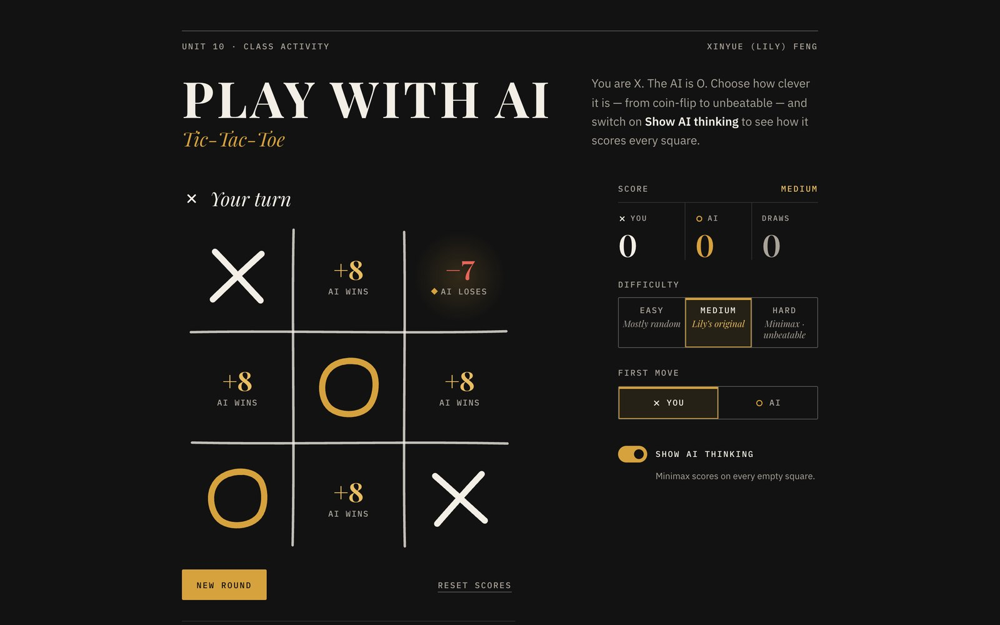

# Play with AI — Tic-Tac-Toe

Tic-tac-toe against three AI opponents, from coin-flip to unbeatable, with a
live view of how the AI scores every square.

By **Xinyue (Lily) Feng**. Built for Unit 10 AS1 “Play with AI” and polished
for her portfolio. Plain HTML, CSS and JavaScript: no frameworks, no build
step, no external requests.



## Features

- **Three opponents.** Easy (mostly random), Medium (Lily’s original
  rule-based AI, unchanged) and Hard (minimax with alpha-beta pruning, which
  never loses).
- **Show AI thinking.** Every empty square shows its minimax score from the
  AI’s point of view (positive: AI wins, 0: draw, negative: AI loses),
  updated after every move. A short note explains each AI move: which of
  Lily’s rules fired, or how minimax chose, and whether it was the best
  move available.
- **Either side can start.** First move: You or AI.
- **A scoreboard for each difficulty,** remembered in `localStorage`. The
  game still works when storage is blocked.
- **Accessible.** The board is an ARIA grid: Tab into it, move with the
  arrow keys (plus Home/End), and place your X with Enter or Space. Every
  square has a label such as “Row 1, column 2, empty”, a live region
  announces turns and AI moves, focus rings are visible, text meets WCAG AA
  contrast, and the page supports reduced motion and Windows high-contrast
  mode.
- **A hand-drawn board.** The grid lines, X and O draw themselves as SVG
  strokes, and the winning line is struck through in gold.
- **Embeddable.** `?embed=1` shows only the game, for an iframe (see below).

## How the three AIs work

All three live in [`ai.js`](ai.js) as pure functions: no DOM, so the
browser and the tests run exactly the same code. A board is an array of 9
cells, each `"X"`, `"O"` or `""`.

### Easy: mostly random (`easyMove`)

Easy picks a random empty square. About half the time it first checks
whether any square wins on the spot and takes it, so it can still pounce. It
never blocks you.

### Medium: Lily’s original (`ruleBasedMove`)

This is the AI from the Unit 10 assignment, preserved line for line with its
original comments. Only the plumbing changed: the board and players come in
as arguments instead of globals, moves are tried on a copy of the board, and
the random source can be swapped out for tests. It tries five rules in
order:

1. win if it can;
2. block your winning move;
3. take the center;
4. take a random corner;
5. take a side.

It plays sensibly but only looks one move ahead, so it can’t see a **fork**
coming. Start in a corner, answer its center with the opposite corner, then
block the corner it takes. That block leaves you two ways to win, and it can
only stop one.

### Hard: minimax with alpha-beta pruning (`minimaxMove`)

Minimax imagines every way the game could continue. On the AI’s turns it
assumes the AI picks the highest-scoring move; on yours it assumes you pick
the lowest, which is your best reply. Finished games are scored +10 for an AI
win, −10 for a loss and 0 for a draw, minus one point per move, so a quick
win beats a slow one and a slow loss beats a quick one. Alpha-beta pruning
skips any branch the other side would never allow: the answer is the same,
but far fewer positions are searched. Tic-tac-toe is small enough (5,478
legal positions) that Hard searches to the end of the game before every move,
breaking ties at random so games vary. Perfect play from both sides is a
draw, so against Hard a draw is the best you can do.

### Reading the scores

With **Show AI thinking** on, each empty square shows the score of the next
move going there, counted from the AI’s side (`evaluateMoves`). On the AI’s
turn it is the maximizer: Hard always plays a top score, while Easy and
Medium may not. On your turn you are the minimizer, so the lowest number is
your best reply. A ◆ marks minimax’s pick for whoever moves next. While the
view is on, the AI pauses about a second (instead of about half a second) so
you can read its scores before it moves.

## Run it

Browsers block ES modules on `file://`, so serve the folder over HTTP with
any static server:

```sh
npx serve .                 # or: python3 -m http.server 8000
```

Then open the address it prints.

## Tests

```sh
npm test                    # runs node --test (Node 18+, no dependencies)
```

[`tests/ai.test.js`](tests/ai.test.js) checks that:

- `getWinner` finds all 8 lines for both players; `isDraw` and `emptyCells`
  behave;
- **Medium** follows Lily’s priorities (win > block > center > corner >
  side), never touches the board it is given, loses to the opposite-corner
  fork, and plays **move for move like the untouched `original/script.js`**
  (run in a sandbox) on every reachable position;
- **Hard never loses**: the suite plays every possible human move sequence
  against it, branching over every move Hard might pick, both with the human
  starting (6,112 games) and with the AI starting (10,640 games). Its scores
  match a plain, unpruned minimax on every reachable position; it prefers
  faster wins and slower losses; and it varies its choice between equally
  good moves;
- **Easy** always returns a legal move and takes an immediate win about half
  the time.

## Embedding

`?embed=1` hides the page header, the “How the AI works” section and the
footer, leaving the game and its controls with no outer margin. Below 600 px
wide it stacks into one column.

```html
<iframe id="tic-tac-toe" src="/projects/tic-tac-toe/?embed=1"
        title="Tic-tac-toe: play with AI" loading="lazy"
        style="display:block; width:100%; height:600px; border:0"></iframe>
<script>
  // Optional: the game posts its height whenever it changes, so the frame
  // can fit it exactly, with no scrollbars.
  const frame = document.getElementById("tic-tac-toe");
  window.addEventListener("message", (event) => {
    if (event.source === frame.contentWindow && event.data?.type === "tic-tac-toe:height") {
      frame.style.height = `${event.data.height}px`;
    }
  });
</script>
```

URL options work in embed mode and on the full page:

| Option | Values | Effect |
| --- | --- | --- |
| `difficulty` | `easy`, `medium`, `hard` | starting difficulty |
| `first` | `you`, `ai` | who moves first |
| `thinking` | `1`, `0` | “Show AI thinking” on or off |
| `bg` | `transparent` | embed only: drop the page background |

URL options don’t overwrite what a visitor has saved. By default the embed
keeps the portfolio’s `#121212` background, so it looks the same in every
browser. With `bg=transparent`, give the host page `color-scheme: dark` as
well; otherwise some browsers paint an opaque backdrop behind a dark-scheme
frame.

## Project structure

```
index.html          page markup
style.css           styles (design tokens at the top)
script.js           the game UI: board, controls, scores, "Show AI thinking"
ai.js               the three AIs and board helpers (pure functions, no DOM)
tests/ai.test.js    node:test suite for ai.js
package.json        "type": "module" and the test script (no dependencies)
favicon.svg
fonts/              self-hosted Playfair Display, IBM Plex Sans and IBM Plex Mono, with their licences
original/           the original Unit 10 files, untouched
```

## Credits

- Originally created by Xinyue (Lily) Feng for Unit 10 AS1 “Play with AI”,
  April 2026. The original files are preserved in [`original/`](original/),
  and her AI lives on as Medium.
- Fonts: [Playfair Display](https://github.com/clauseggers/Playfair-Display)
  and [IBM Plex](https://github.com/IBM/plex) Sans and Mono, under the SIL
  Open Font License 1.1 (see `fonts/LICENSE-*.txt`).
